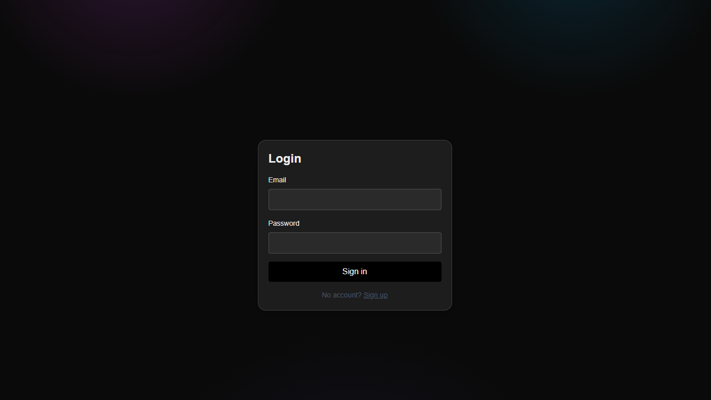
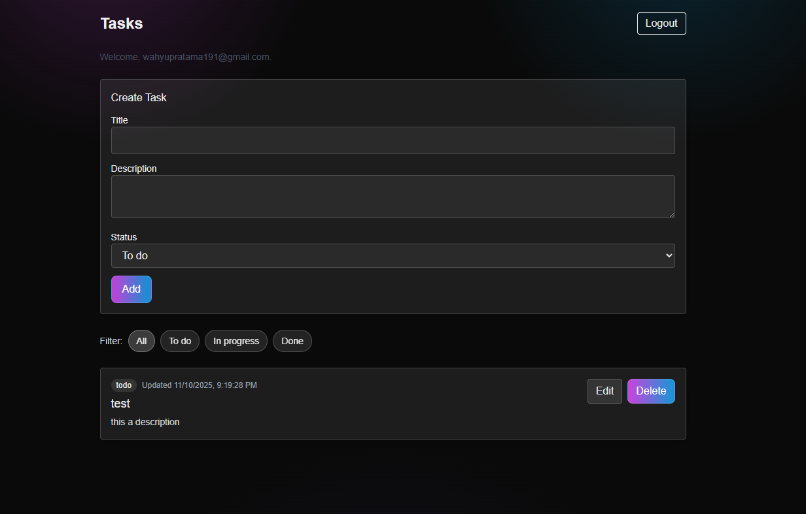
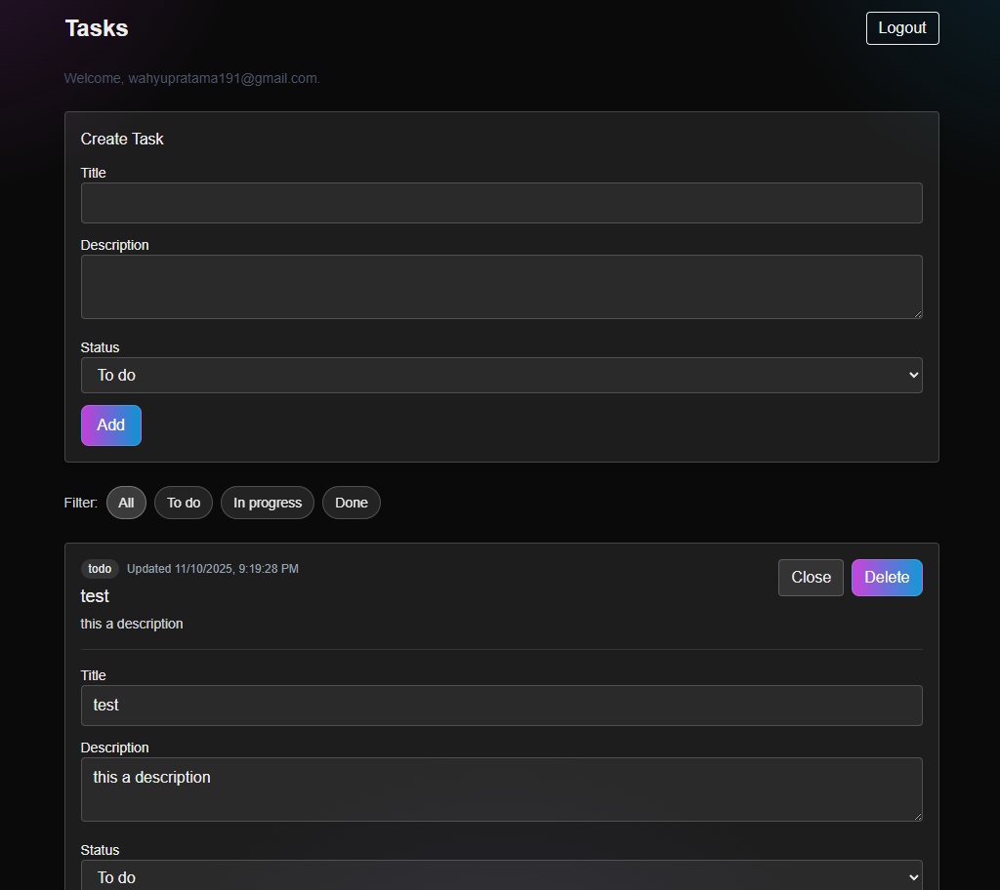

# Second Talent FE Test — Next.js App

A Next.js 15 application featuring authentication pages and a tasks module (task list and create/edit). It includes internationalization, Tailwind CSS v4, TypeScript, testing with Vitest, and a commit workflow powered by Husky, Commitlint, and Commitizen.

This repository is prepared to run locally or via Docker Compose. Command snippets are provided for zsh.

---

## Project Structure

- src/app — App Router pages and layout
  - login — Authentication page
  - signup — Signup page
  - tasks — Task list and create/edit page
  - layout.tsx — Root layout
  - page.tsx — Home page
- src/components — Reusable UI components
  - layout — Layout-related docs
  - tasks — Task UI (filters, list)
  - ui/LangSwitcher — Language switcher component
  - utils/twMerge.ts — Tailwind merge helper
- src/data — Client-side repositories and stores
  - auth — auth.repository.ts, auth.store.ts
  - task — task.repository.ts, task.store.ts
- src/domain — Domain layer and tests (auth, task)
- src/features — Feature-level docs
- src/i18n — Internationalization config and request helper
- src/services — Shared services like locale
- messages — Translation JSON files (e.g., en.json, id.json)
- public — Static assets

---

## Technical Choices

- Next.js 15 (App Router) and React 19 for modern, file-based routing and concurrent features
- TypeScript for static typing and maintainability
- next-intl for internationalization and locale handling
- Tailwind CSS v4 for utility-first styling
- Vitest for fast unit testing
- ESLint + Prettier to enforce consistent code style
- Husky + Commitlint + Commitizen for clean, conventional commit history
- Production image via Docker multi-stage build using Next.js standalone output

---

## Run with Docker Compose (zsh)

Prerequisites:
- Docker and Docker Compose plugin installed

Build the image:
```zsh
docker compose build
```

Start the container:
```zsh
docker compose up -d
```

Open the app:
- http://localhost:3000

Stop the app:
```zsh
docker compose down
```

Notes:
- The Dockerfile uses a multi-stage build to create a small runtime image with Next.js standalone output.
- The app listens on port 3000 in the container and is published to 3000 on the host.

---

## Authentication — Test Credentials

The app starts with a seeded demo account you can use to log in:

- Email: demo@example.com
- Password: demo123

You can also create a new account via the Signup page, then log in with those credentials. Authentication here is for demo purposes only and uses an httpOnly cookie (`tm_session`) with an in-memory store.

---

## Local Development (zsh)

Install dependencies:
```zsh
npm install
```

Start the dev server:
```zsh
npm run dev
```

Open the app:
- http://localhost:3000

Run tests:
```zsh
npm test
# or
npm run test:watch
```

Lint and format:
```zsh
npm run lint
```

---

## Internationalization

This project uses next-intl. Translation messages live in the messages/ folder (e.g., en.json, id.json). See src/i18n/config.ts for configuration details and src/services/locale.ts for helpers. The UI includes a language switcher component at src/components/ui/LangSwitcher.

---

## Screenshots

Place screenshots in the root-level screenshots/ directory and commit them. Suggested filenames:
- screenshots/login.png — Authentication page
- screenshots/task-list.png — Task list page
- screenshots/task-create-edit.png — Create/Edit task page

You can also embed them here in the README once added:

- Authentication: 
- Task list: 
- Create/Edit task: 

---

## Commit Workflow (Clean History)

This repository is configured for conventional commits to ensure a clean, readable history.

Create a commit message using Commitizen:
```zsh
npm run commit
```

Husky will run checks and enforce Commitlint rules automatically on commit.

---

## Troubleshooting (zsh)

- Prefer `docker compose` over the legacy `docker-compose` command.
- If port 3000 is in use locally, stop any conflicting processes or change the published port in docker-compose.yml.
- For authentication code paths, the login action entry point is `loginAction` in `src/data/auth/auth.repository.ts`.

---

## License

MIT
